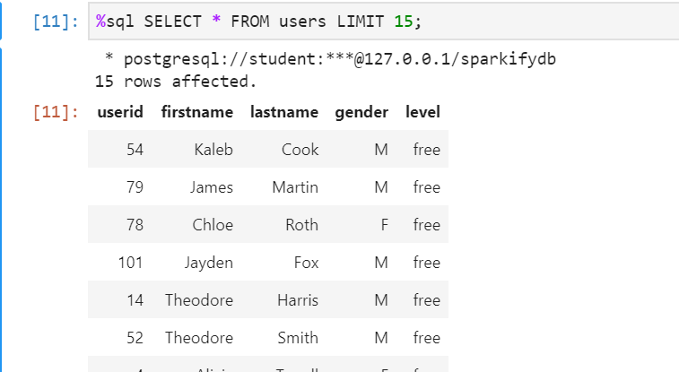
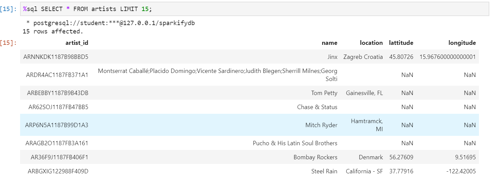
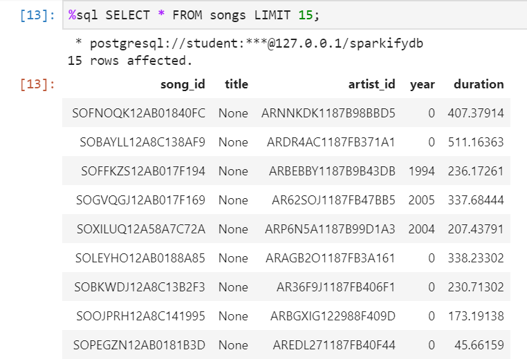
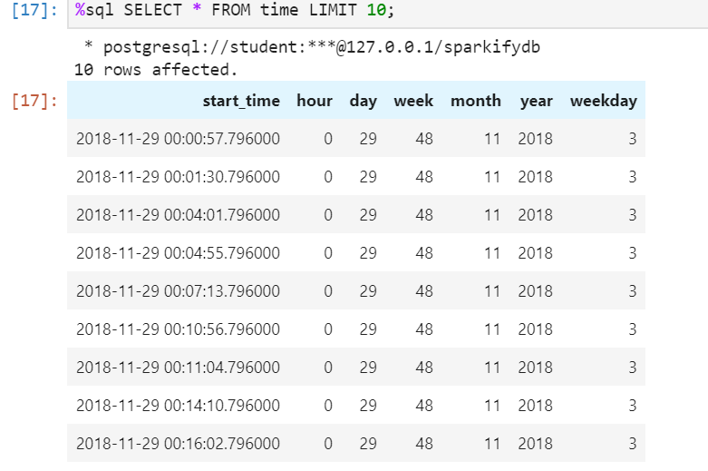
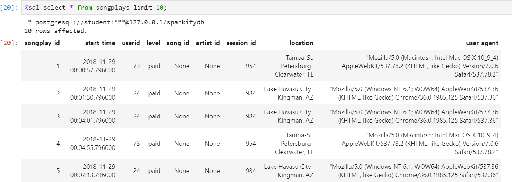
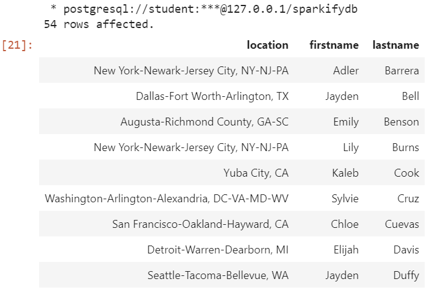

## Sparkify DB and ETL

Sparkify has a requirement to analyze user activity on their new streaming music app. Their information of interest is stored in JSON files for both the song metadata and user activity. 

They want to do analytics on the songs played and thus a Postgres DB with appropriate tables along with an ETL job has been created to meet this requirement.

### Dataset:
#### Song Dataset
The song dataset is a subset of real data from the [Million Song Dataset](https://labrosa.ee.columbia.edu/millionsong/). Each file is in JSON format and contains metadata about a song and the artist of that song. The files are partitioned by the first three letters of each song's track ID.

#### Log Dataset
The logdataset consists of log files in JSON format generated by this  [event simulator](https://github.com/Interana/eventsim)  based on the songs in the dataset above. These simulate app activity logs from a music streaming app based on specified configurations. The log files in the dataset are partitioned by year and month

### Tables:

#### Songplays Table
The songplays table consists of records in log data associated with song plays i.e. records with page `NextSong`. The attributes are _songplay_id, start_time, userId, level, song_id, artist_id, session_id, location, user_agent_.  The *songplay_id* is set as an auto-incrementing variable, the *start_time* is set as a TIMESTAMP, the *session_id* being an INTEGER and the *user_agent* being TEXT since it can be very long. All the other attributes are set to VARCHAR.

#### Users Table
The Users Table consists of the *userId , firstname, lastname, gender* and *level*. All the attributes are alphanumeric in nature and have thus been set to VARCHAR in the DB.

 #### Song Table
 The Song Table from the music database consists of *songId, Title, artistID, Year* and *duration*. INTEGER data type is a good fit for the *Year* field and the *duration* field is a floating point number and is therefore set to a NUMERIC type in the DB. The others are all set to VARCHAR since they are alphanumeric.
 
 #### Artists Table
The Artists  Table from the music database consists of the *ArtistID, Name, Location , the Latitude* and *Longitude*. The *Latitude* and *Longitude* are floating point variables and have been set to NUMERIC as such. The others are alphanumeric and are thus set to VARCHAR.
 
 
 #### Time Table
 The Time Table consists of timestamps of records in **songplays** broken down into specific units. The attributes are  *start_time, hour, day, week, month, year*, and *weekday*. The *start_time* is set to a TIMESTAMP and the *weekday* to a VARCHAR and the rest are non fractional numbers are a good fir for INTEGER data type.
 
### ETL Approach
The ETL job first processes the song files followed by the log files. The song files are listed and iterated over entering relevant information in the *artists* and the song tables. This is followed by processing the log files. The log files are first filtered by the `NextSong` action. The subsequent dataset is then processed to extract the date , time , year etc. fields and records are then appropriately entered into the *time*, *users* and *songplays* tables.

### Files
There are 3 python files applicable to this project. The *sql_queries.py* file has all the queries to create, update and drop the DB tables. The *create_tables.py* module consists of the scripts to drop and recreate all the tables. The *etl.py* is the file that undertakes the ETL job of reading the data files and running the ETL job to store the data into the appropriate tables. It is assumed that the song files are stored under *data/song_data* and the log files are stored under *data/log_data*.

### Scripts
To run the scripts, please ensure that there is an existing connection to a Postgres DB with 'student' and 'student' as the username and password. Then run the create_tables.py script first to drop existing tables and create new ones. Subsequently run the etl.py script to load the the data into the tables in the database.

### Final Tables Structure
A Sample snapshot of the final table structures are as below:

    The Users Table

    The Artists Table
   

    The Songs Table
  

    The Time Table

    The Songplays Table

### Sample Analytics Query/Response
Give me the unique list of users and locations played after a certain date (11/28/2018) e.g. Post-Thanksgiving sorted by lastname:

**Query**
*%sql SELECT distinct songplays.location, users.firstname, users.lastname FROM songplays join users on songplays.userid = users.userid where start_time > '2018-11-28 00:00:00' order by lastname ;*

**Response**:

